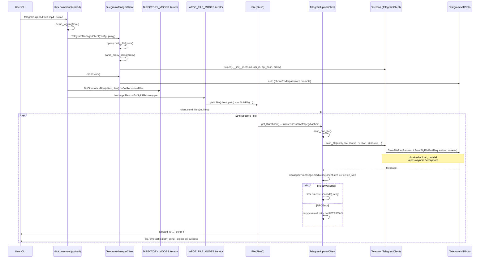

# 01. Архитектура и слои

## Слои

Архитектурные слои в проекте есть, но они **не оформлены явно** (нет namespace-папок типа `core/`, `domain/`, `infra/`). Логически их можно нарезать так:

| Слой | Где живёт | Что делает |
|---|---|---|
| **CLI / presentation** | [telegram_upload/management.py](../telegram_upload/management.py), [telegram_upload/cli.py](../telegram_upload/cli.py) | Парсинг аргументов через `click`, интерактивные виджеты `prompt_toolkit`, прогресс-бары. |
| **Configuration** | [telegram_upload/config.py](../telegram_upload/config.py), [telegram_upload/logging_config.py](../telegram_upload/logging_config.py), [telegram_upload/constants.py](../telegram_upload/constants.py) | Чтение `~/.config/telegram-upload.json`, переменные окружения, magic numbers. |
| **Domain / models** | [telegram_upload/upload_files.py](../telegram_upload/upload_files.py), [telegram_upload/download_files.py](../telegram_upload/download_files.py), [telegram_upload/caption_formatter.py](../telegram_upload/caption_formatter.py) | `File`, `SplitFile`, `DownloadFile`, итератор-стратегии, шаблонизатор подписей. |
| **Infrastructure (Telegram)** | [telegram_upload/client/](../telegram_upload/client/) | `TelegramManagerClient` (фасад) + два миксин-клиента, наследующих `telethon.TelegramClient`. |
| **Infrastructure (FS / media)** | [telegram_upload/video.py](../telegram_upload/video.py), [telegram_upload/metadata_helpers.py](../telegram_upload/metadata_helpers.py), [telegram_upload/utils.py](../telegram_upload/utils.py) | `ffmpeg` через subprocess, `hachoir` для метаданных, помощники вокруг файловой системы. |
| **Cross-cutting** | [telegram_upload/exceptions.py](../telegram_upload/exceptions.py), [telegram_upload/_compat.py](../telegram_upload/_compat.py) | Иерархия исключений + `catch` decorator, бэкпорты для старых Python. |

Между слоями нет жёстких контрактов — domain свободно дёргает FS (`os.path.getsize`, `os.remove`), а в client/-модуле прямо в `send_files` ([telegram_upload/client/telegram_upload_client.py:118-162](../telegram_upload/client/telegram_upload_client.py#L118-L162)) выводится click-сообщение об ошибке и удаляется локальный файл. То есть UI/IO/бизнес-логика **переплетены**.

## Поток данных (upload)

Ключевые узлы:

- Точка входа в загрузку: [telegram_upload/management.py:149-200](../telegram_upload/management.py#L149-L200) — `upload()`. Здесь же выбор стратегий (директорий, крупных файлов, thumbnail).
- Конкретный chunked upload: метод `upload_file` переопределён прямо в проекте ([telegram_upload/client/telegram_upload_client.py:164-345](../telegram_upload/client/telegram_upload_client.py#L164-L345)) — это **скопированная и доработанная** версия из Telethon, чтобы добавить параллелизм через `upload_semaphore` и retry-логику в `_send_file_part`.
- Chunked download аналогично: [telegram_upload/client/telegram_download_client.py:61-127](../telegram_upload/client/telegram_download_client.py#L61-L127) — переопределённый `_download_file`, который через `grouper(...)` пускает `PARALLEL_DOWNLOAD_BLOCKS=10` параллельных задач.

## Где состояние, где I/O, где чистая логика

- **Состояние:**
  - Файл сессии Telethon (`~/.config/telegram-upload[.session]`) — единственный долговременный state.
  - JSON-конфиг (`~/.config/telegram-upload.json`) — `api_id`, `api_hash`, опц. `session`.
  - Внутри `TelegramManagerClient`: `self.config_file`, кешированные `me` ([telegram_upload/client/telegram_manager_client.py:153-155](../telegram_upload/client/telegram_manager_client.py#L153-L155)), `upload_semaphore`, `reconnecting_lock`.
- **I/O:**
  - Файловая: открытие через `FileIO` в [telegram_upload/upload_files.py:159-164](../telegram_upload/upload_files.py#L159-L164) (`File` наследует `FileIO`!), запись через `_download_file`, `pipe_file` для join-стратегий.
  - Сетевая: всё через Telethon → MTProto.
  - Subprocess: `ffmpeg` для thumbnail ([telegram_upload/video.py:21-30](../telegram_upload/video.py#L21-L30)).
- **Чистая логика (изолирована):**
  - `caption_formatter.CaptionFormatter` — sandbox-формат подписей (whitelist методов).
  - `Duration.for_humans`, `FileSize.for_humans`.
  - `download_files.UnionJoinStrategy.is_applicable` / `is_part`.
  - `utils.sizeof_fmt`, `utils.truncate`, `utils.grouper`.

Чистой логики мало; большая часть кода либо общается с Telegram, либо открывает файлы.

## Сильные стороны

1. **Разделение upload/download/manager на отдельные классы.** Multiple inheritance (`TelegramManagerClient(TelegramUploadClient, TelegramDownloadClient)` ([telegram_upload/client/telegram_manager_client.py:95](../telegram_upload/client/telegram_manager_client.py#L95))) превращает каждый из миксинов в самостоятельную единицу поведения, и они тестируются отдельно (`tests/test_client/test_telegram_upload_client.py`).
2. **Strategy для split/join.** `KeepDownloadSplitFiles` vs `JoinDownloadSplitFiles`, `NoLargeFiles` vs `SplitFiles` — нормально оформленный паттерн с базовыми классами и dict-маппингом ([telegram_upload/management.py:26-37](../telegram_upload/management.py#L26-L37)). Расширяется добавлением класса.
3. **CaptionFormatter с whitelist** ([telegram_upload/caption_formatter.py:319-344](../telegram_upload/caption_formatter.py#L319-L344)) — пользовательские шаблоны подписей не дают вызывать произвольные методы, тип результата валидируется.
4. **Параллелизм аккуратно ограничен семафором** (`upload_semaphore`, размер из `TELEGRAM_UPLOAD_PARALLEL_UPLOAD_BLOCKS`).
5. **Retry-логика** есть и для FloodWait, и для RPCError, и для `InvalidBufferError 429`.
6. **Конфигурируемость через env-переменные** для тонких настроек (`TELEGRAM_UPLOAD_MAX_RECONNECT_RETRIES`, `TELEGRAM_UPLOAD_RECONNECT_TIMEOUT`, `FFMPEG_COMMAND`, `TELEGRAM_UPLOAD_LOG_FILE`, ...).

## Слабые стороны

1. **Связанность CLI и клиента.** В `TelegramUploadClient.send_files` ([telegram_upload/client/telegram_upload_client.py:107-141](../telegram_upload/client/telegram_upload_client.py#L107-L141)) **внутри infrastructure-слоя** напрямую вызывается `click.echo(...)`. То же самое в `_send_file_part` (строки 369, 374, 415, 417). Если захочется встроить пакет в библиотеку, возникнут лишние сообщения в stderr. SRP нарушен.
2. **`File(FileIO)` — domain-объект унаследован от низкоуровневого `io.FileIO`.** ([telegram_upload/upload_files.py:159](../telegram_upload/upload_files.py#L159)). Файл **сам себя открывает** в `__init__` и больше не закрывается явно. Это утечка дескрипторов в долгих циклах и трудно отделить «модель файла» от «открытого потока». `SplitFile(File, FileIO)` ([upload_files.py:223](../telegram_upload/upload_files.py#L223)) — двойное наследование от `FileIO` через `File`, нечеткий MRO.
3. **Хардкод магических чисел.**
   - `RETRIES = 3`, `ALBUM_FILES = 10`, `BOT_USER_MAX_FILE_SIZE = 52428800`, `USER_MAX_FILE_SIZE = 2097152000`, `PREMIUM_USER_MAX_FILE_SIZE = 4194304000` — все в [telegram_upload/client/telegram_manager_client.py:41-43](../telegram_upload/client/telegram_manager_client.py#L41-L43) и [telegram_upload/client/telegram_upload_client.py:20-24](../telegram_upload/client/telegram_upload_client.py#L20-L24).
   - Часть из них **продублирована** в `constants.py` ([telegram_upload/constants.py:14-22](../telegram_upload/constants.py#L14-L22)), но реально оттуда импортируется только `SPLIT_FILE_PART_NUMBER_PADDING`. Видно, что начался рефакторинг и не завершён.
4. **`TelegramManagerClient.__init__` делает слишком много.** ([telegram_upload/client/telegram_manager_client.py:96-138](../telegram_upload/client/telegram_manager_client.py#L96-L138)) — открывает файл, парсит JSON, валидирует ключи, читает proxy из env, парсит proxy-строку, обрабатывает MTProxy. Шесть веток try/except. Cyclomatic complexity = 10 (radon B).
5. **`management.upload()` — длинная процедура** длиной ~52 строки ([telegram_upload/management.py:149-200](../telegram_upload/management.py#L149-L200)). CC=19 (radon C). Логика «interactive vs non-interactive» переплетена с логикой выбора стратегий.
6. **Доступ к приватным API сторонних библиотек.**
   - `from prompt_toolkit.widgets.base import E, _DialogList` ([telegram_upload/cli.py:10](../telegram_upload/cli.py#L10)) — импорт приватного класса.
   - `metadata._MultipleMetadata__groups` ([telegram_upload/metadata_helpers.py:43,45,59,60,62](../telegram_upload/metadata_helpers.py#L43)) — обращение к name-mangled приватному атрибуту hachoir, чтобы вытащить video-stream из MKV. Уже описано в самом docstring как «не идеально».
   - `from telethon import helpers, custom`, `helpers._FileStream`, `helpers._maybe_await` ([telegram_upload/client/telegram_upload_client.py:8,259,297,388](../telegram_upload/client/telegram_upload_client.py#L8)) — приватные имена с подчёркиванием.
   - Любой апгрейд этих библиотек может тихо сломать поведение.
7. **Отсутствует абстракция над Telegram.** Прямое использование `telethon.tl.types`/`telethon.tl.functions` повсюду делает невозможной подмену движка (например, на `pyrogram`). Если в форке планируется поддерживать несколько backends, придётся вводить интерфейс самим.
8. **Глобальное состояние через env-переменные.** `PARALLEL_UPLOAD_BLOCKS = get_environment_integer(...)` читается **на уровне модуля при импорте** ([telegram_upload/client/telegram_upload_client.py:19-24](../telegram_upload/client/telegram_upload_client.py#L19-L24)) — изменить runtime'но невозможно.
9. **Непоследовательная обработка ошибок.** В одних местах исключение → `click.echo(..., err=True)` без подъёма ([upload_files.py:204-206](../telegram_upload/upload_files.py#L204-L206)), в других — рекурсивный retry с уменьшением счётчика ([upload_client.py:109-115](../telegram_upload/client/telegram_upload_client.py#L109-L115)), в третьих — `raise RuntimeError(...)` ([upload_client.py:390](../telegram_upload/client/telegram_upload_client.py#L390)). Унифицированной политики нет.
10. **Скопированный код Telethon.** Методы `upload_file` и `_download_file` — это вилки соответствующих методов Telethon, где добавлен параллелизм. При апгрейде Telethon (особенно при v2) эти методы придётся переписывать вручную — диффы могут разойтись непредсказуемо.

## Что мешает расширяемости

| Хочется добавить | Куда упрётесь |
|---|---|
| Новый источник файлов (URL, S3, ...) | `File` сам открывает локальный путь через `FileIO.__init__(path)`. Придётся либо подменять `File`, либо распилить «модель файла» от «открытого потока». |
| Свой прогресс-репортер (например, в БД или WebSocket) | `get_progress_bar` ([progress_bar.py:6](../telegram_upload/client/progress_bar.py#L6)) жёстко создаёт `click.progressbar`. Передать колбэк извне нельзя. Нужен либо параметр `progress_factory`, либо фабрика как поле клиента. |
| Хук «перед/после загрузки» | Нет публичных hook'ов. Всё переопределяется только наследованием `TelegramUploadClient` и переопределением `send_one_file` / `send_files`. |
| Новый тип split (zip, rar) | Достаточно добавить класс в `JOIN_STRATEGIES` ([download_files.py:96-98](../telegram_upload/download_files.py#L96-L98)) — это самое расширяемое место в проекте. |
| Новая CLI-команда (например, `telegram-list`) | Нужно дописать `@click.command()` в `management.py`, добавить `entry_point` в `setup.py:140-143`. Тривиально. |
| Заменить движок Telegram (Pyrogram / aiogram) | Невозможно без серьёзного рефакторинга — нет абстракции, прямые импорты `telethon.tl.*` в 7+ модулях. |
| Поддержать загрузку через Bot API | То же самое — нет интерфейсного слоя. |
| Подменить thumbnail-генератор | `get_file_thumb` ([upload_files.py:81-93](../telegram_upload/upload_files.py#L81-L93)) хардкодит `get_video_thumb` (ffmpeg). Нужно вводить strategy. |
| Добавить шифрование на стороне клиента | На уровне `upload_file` есть параметры `key`/`iv` (унаследовано от Telethon-копии), но через CLI они не пробрасываются и нигде не вызываются. |

## Открытые вопросы

- Планируется ли вынести взаимодействие с Telegram за интерфейс (для тестируемости и потенциальной замены движка)?
- Стоит ли разделить `File` на «дескриптор файла» и «модель для отправки» (избавиться от наследования `FileIO`)?
- Нужно ли убрать `click.echo` из infrastructure-слоя (`client/`) и заменить на logging + callback'и?
- Какую часть Telethon-функционала используете явно: только high-level `send_file`/`download_media` или ныряете в `tl.functions.*`?
